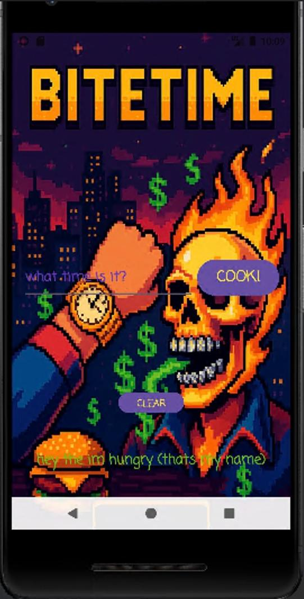
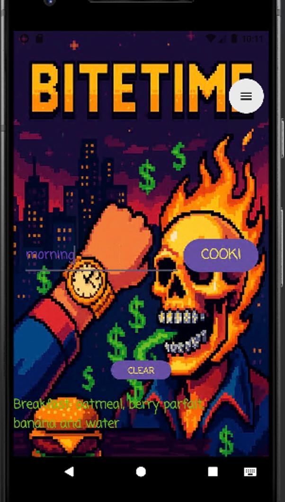

# BITETIME

**BITETIME** is a fun, interactive mobile application that suggests pixel-art-style meal options based on the time of day—breakfast, lunch, or dinner. It combines visually appealing animations and a dynamic user interface inspired by games like **Jetpack Joyride**. The app is designed to make meal planning easier, more enjoyable, and visually stunning.

## Purpose

The **BITETIME** app aims to provide users with quick, visually engaging meal suggestions based on the current time, making it easy for them to decide what to eat while enjoying a playful app experience.

## Features

- **Time-based meal suggestions**: Provides users with a curated list of meals based on breakfast, lunch, or dinner time.
- **Pixel-art style design**: Features pixel-art visuals, making the meal suggestions fun and visually engaging.
- **User-friendly interface**: Easy-to-use interface designed to mimic the gameplay mechanics of classic mobile games.
- **Animated elements**: Dynamic backgrounds and animated elements enhance the user experience.

## Installation

To install and run the **BITETIME** app locally, follow these steps:

1. Clone the repository:
   ```bash
   git clone https://github.com/yourusername/BITETIME.git
   ```

2. Open the project in Android Studio.

3. Run the app on an Android emulator or physical device.

## Usage

- Launch the app and enjoy the interactive, animated meal suggestions based on the time of day.
- Tap through the available meal options and explore different meals for each time slot.

## Video

A detailed video explaining how to use the app, the development process, and the design decisions can be found here:  
[https://www.youtube.com/live/QJ1RmBCo5Pw?si=AJssxdVPRjtEjCMf]

## GitHub Actions

The app utilizes **GitHub Actions** for continuous integration and automated builds. You can find more information on how it works in the `.github` folder of this repository.

## Screenshots

  


## Contribution

Feel free to fork the repository, submit pull requests, and contribute to the project. Contributions are always welcome.

## License

This project is licensed under the MIT License - see the [LICENSE](LICENSE) file for details.
